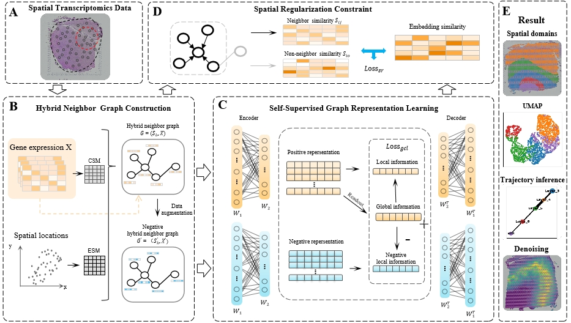

# stHGC
# stHGC: A Self-Supervised Graph Representation Learnig Framework for Spatial Domain Recognition with Hybrid Graph and Spatial Regularization

## model
Overview
<div align="center">
  
</div>
Advancements in spatial transcriptomics (ST) technology have enabled the analysis of gene expression while preserving
cellular spatial information, greatly enhancing our understanding of cellular interactions within tissues. Accurate
identification of spatial domains is crucial for comprehending tissue organization. However, effectively integrating multi-
dimensional information poses significant challenges. To address these challenges, we propose a novel self-supervised
graph representation learning framework named stHGC for identifying spatial domains. Firstly, a hybrid neighbor graph
is constructed by integrating information from different similarity metrics to represent spatial proximity and high-
dimensional gene expression feature similarity. Secondly, a self-supervised graph representation learning framework is
introduced to learn the representation of spots in ST data. Within this framework, the graph attention mechanism
is utilized to characterize relationships between adjacent spots, while the self-supervised method ensures distinct
representations for non-neighboring spots. Lastly, a spatial regularization constraint is employed to enable the model to
retain the structural information of spatial neighbors. Experimental results demonstrate that stHGC outperforms state-
of-the-art methods in identifying spatial domains across ST datasets with different resolutions and species. Furthermore,
stHGC proves beneficial for downstream tasks such as denoising and trajectory inference, showcasing its scalability in
handling ST data.


## Environments

```
- python                    3.7.12
- cuda                      11.7
```

## Dependencies

```
- matplotlib                3.5.3
- numpy                     1.21.6
- pandas                    1.3.5
- r-base                    4.0.3
- rpy2                      3.5.1
- scanpy                    1.9.2
- stlearn                   0.4.12
- torch                     1.13.0+cu117
```

## Dataset
DLPFC tissue data are available from spatialLIBD (http://spatial.libd.org/spatialLIBD).

Mouse olfactory bulb tissue data generated by Stereo-seq and Slide-seqV2 platforms can be obtained from https://github.com/JinmiaoChenLab/SEDR_analyses and https://singlecell.broadinstitute.org/single_cell/study/SCP815, respectively.

10x Visium Human Breast Cancer dataset: https://support.10xgenomics.com/spatial-geneexpression/datasets

Bronchial Adenoma dataset available at https://zenodo.org/record/8185216 Accessed.
We provide DLPFC datasets processed in our code.
